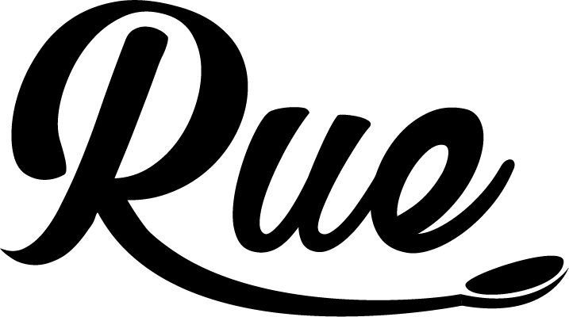

<!--  -->

## Integrantes
* Brenda Mendez Torres:
  * Hola soy estudiante de maestria en Direccion Logistica y Cadena de Suministro y estoy interesada en la creacion de sitios web y la aplicacion de algoritmos aplicados a la industria automotriz. Mi principal aportacion al trabajo es el process management. 
* Flavio Isay Valladolid Magaña
  * Soy estudiante de Ingeniería en Nanotecnología con interés en la desarrollo web, UI/UX y en la ciencia de datos para la optimización de procesos. Considero que mi aportación clave en este proyecto es el diseño de interfaces y contenido.
* Luis Jesus Villegas Castillo
  * Soy estudiante de la carrera de Ingeniería en informática octavo semestre, me gusta programar y mi principal interés es el entorno web para el desarrollo.

## Descripción

Nuestro país es famoso mundialmente por su gastronomía y no hay mejor interpretación que la comida callejera en México, donde te puedes deleitar a buen precio. Por eso <strong>RUE</strong> estará orientada a una gran cantidad de puestos y platillos callejeros que aún no cuentan con una cadena de suministro digital y que por su naturaleza de negocio informal, no son candidatos de aplicaciones actuales en el mercado. 
<strong>RUE</strong> es una aplicación que opera de una forma sencilla e intuitiva donde los usuarios  podrán pedir comida a domicilio, basando sus elecciones a partir de recomendaciones de otros usuarios.
De igual manera los restaurantes se pueden registrar y agregar sus respectivos platillos a vender ofreciendo los servicios a domicilio.

## Sitios de referencia
* **[Rappi](https://www.rappi.com.mx/)**
* **[Uber Eats](https://www.ubereats.com/)**
* **[DidiFood](https://www.didi-food.com/es-MX)**
* **[IFood](http://ifoodmexico.com.mx/)**
* **[Yelp](https://www.yelp.com/)**
* **[DoorDash](https://www.doordash.com/)**

<ppEl align="justify">Estos sitios fueron elegidos, ya que el sitio Rue al igual que estos sitios mencionados anteriormente estará enfocado al los sectores de restaurantes, estos mismos presentan una estética llamativa, cada uno cuenta con una funcionalidad y enfoque diferente.</ppEl>

## Diseño

### Logo

|   Rosa   |  Blanco |  Negro |
| ---- | ---- | ---- |
|   |    |      |

### Colores
- 
1
 #F2274C
- 
<1/div> #91CCD9
- 
1
 #FFFFFF

### Tipografías
- [Montserrat](https://fonts.google.com/specimen/Montserrat?query=montserrat) (para contenido)
- [**Rubik**](https://fonts.google.com/specimen/Rubik?query=rubik) (para titulares)

### Enlaces adicionales
- [Tablero de trabajo](https://trello.com/b/mVW3dA9E)

